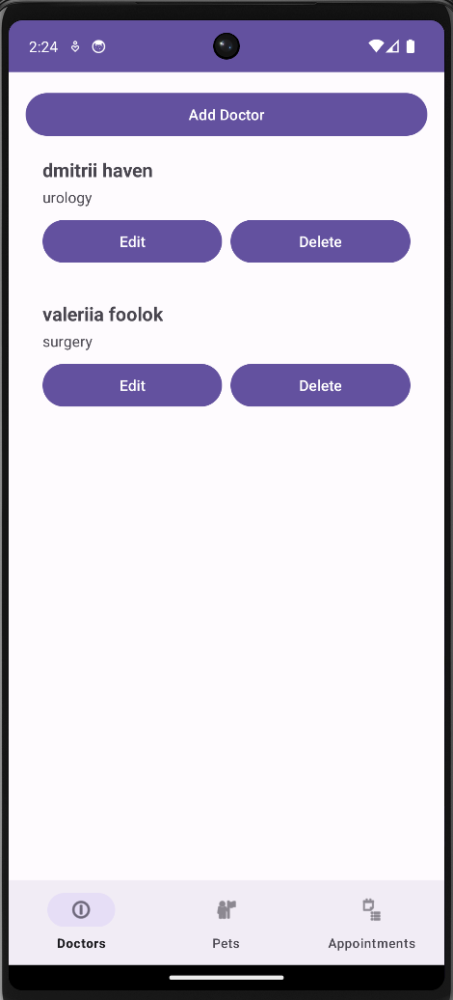
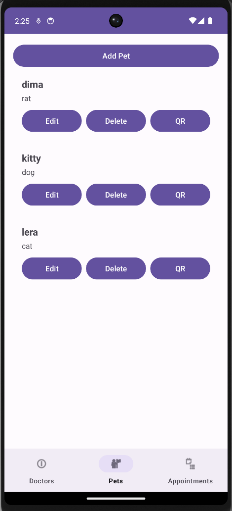
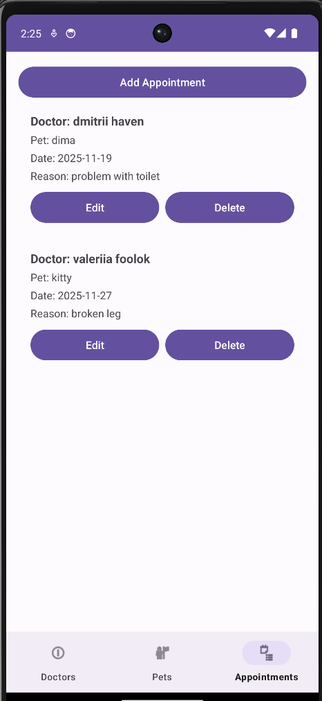

# VetClinicMobile – MobileApps2025-83

## 1. Idea
**VetClinicMobile** is an Android application designed for managing a small veterinary clinic.
The app supports CRUD operations for Doctors, Pets, and Appointments, using a clean MVVM architecture, Room (SQLite), and a modern user interface following Material Design.

This project is submitted for the course Mobile Applications, Academic year 2025, under the repository MobileApps2025-83.

## 2. How it works
The application consists of three core modules, each represented as a Fragment and accessible via Bottom Navigation:
- **Doctors**
  •	Add, edit, delete doctors (name, specialization).
  •	Persistent storage via Room.
  •	Automatically updated list using Flow + StateFlow.
- **Pets**
  •	Add, edit, delete pets (name, type).
  •	Built-in QR-code generator for each pet.
  •	QR content includes pet ID, name and type encoded to JSON.
  •	Data stored locally and restored on restart.
- **Appointments**
  •	Select doctor & pet via spinners.
  •	Choose a date with a native DatePicker dialog.
  •	Add, edit and delete appointments.
  •	Automatic name resolving (IDs → human-readable doctor/pet names).
  
All data persists after app restart thanks to the Room database.

## 3. Architecture
- **Language**:
  •	Kotlin (100%)
- **Mobile requirements**:
  •	Min SDK: 24
  •	Target SDK: Latest stable version
  •	Architecture Pattern: MVVM + Repository
  •	UI: Material 3, Light & Dark themes
  •	Navigation: BottomNavigationView + FragmentManager
- **Data layer**:
  •	Room Database
  •	DAOs for Doctors, Pets, Appointments
  •	StateFlow streams for real-time UI updates
- **Presentation layer**:
  •	Activities / Fragments
  •	ViewModel (AndroidViewModel + viewModelScope)
  •	ViewBinding
  •	Custom adapters for RecyclerView

## 4. Project Structure
MobileApps2025-83/
│
├─ apk/
│   └─ app-release.apk
│
├─ app/
│   ├─ build/
│   ├─ src/
│   │   ├─ main/
│   │   │   ├─ java/com/example/myapplication/
│   │   │   │   ├─ data/
│   │   │   │   │   ├─ dao/
│   │   │   │   │   │   ├─ DoctorDao.kt
│   │   │   │   │   │   ├─ PetDao.kt
│   │   │   │   │   │   └─ AppointmentDao.kt
│   │   │   │   │   ├─ db/
│   │   │   │   │   │   ├─ DatabaseProvider.kt
│   │   │   │   │   │   └─ AppDatabase.kt
│   │   │   │   │   ├─ entity/
│   │   │   │   │   │   ├─ DoctorEntity.kt
│   │   │   │   │   │   ├─ PetEntity.kt
│   │   │   │   │   │   └─ AppointmentEntity.kt
│   │   │   │   │   └─ repository/
│   │   │   │   │       ├─ DoctorRepository.kt
│   │   │   │   │       ├─ PetRepository.kt
│   │   │   │   │       └─ AppointmentRepository.kt
│   │   │   │   ├─ ui/
│   │   │   │   │   ├─ doctors/
│   │   │   │   │   │   ├─ DoctorsListFragment.kt
│   │   │   │   │   │   ├─ DoctorsAdapter.kt
│   │   │   │   │   │   └─ DoctorViewModel.kt
│   │   │   │   │   ├─ pets/
│   │   │   │   │   │   ├─ PetsListFragment.kt
│   │   │   │   │   │   ├─ PetsAdapter.kt
│   │   │   │   │   │   ├─ PetViewModel.kt
│   │   │   │   │   │   └─ PetQRFragment.kt
│   │   │   │   │   ├─ appointments/
│   │   │   │   │   │   ├─ AppointmentsListFragment.kt
│   │   │   │   │   │   ├─ AppointmentsAdapter.kt
│   │   │   │   │   │   └─ AppointmentViewModel.kt
│   │   │   │   │   └─ main/
│   │   │   │   │       └─ MainActivity.kt
│   │   │   │   ├─ utils/
│   │   │   │   │   └─ FlowExt.kt
│   │   │   │   └─ AndroidManifest.xml
│   │   │   ├─ res/
│   │   │   │   ├─ layout/
│   │   │   │   ├─ values/
│   │   │   │   ├─ drawable/
│   │   │   │   └─ mipmap/
│   │   └─ test/
│   ├─ build.gradle.kts
│   └─ proguard-rules.pro
│
├─ build.gradle.kts
├─ settings.gradle.kts
└─ README.md

## 5. User flow
1.	Launch Application
→ Bottom navigation appears (Doctors / Pets / Appointments)
2.	Doctors Screen
→ View list → Add → Edit → Delete
3.	Pets Screen
→ View list → Add → Edit → Delete → Generate QR
4.	Appointments Screen
→ Choose doctor & pet (spinners)
→ Pick date via DatePicker
→ Add appointment
→ Edit or delete existing ones
5.	Database persistence
→ All data saved in Room
→ Instantly restored on next launch


## 6. Steps to run

1. Clone the repository:
```bash
   git clone https://github.com/stu2301321083-svg/MobileApps2025-83.git
   ```
2. Open the project

Android Studio → Open Existing Project → Select folder

3. Wait for Gradle sync

(AndroidX + Room + ZXing libraries)

4. Run

Run → “app”
or build APK via
Build → Generate Signed Bundle / APK

5. (Optional) Install APK

/apk/app-release.apk

⸻


## 7. Screenshots


### Doctors


### Pets


### Appointments


### QR code of pets


## 8. APK

The release APK is located at:
/apk/app-release.apk

## 9. Additional Feature

✔ QR Code generation for Pets
•	Implemented with ZXing (com.journeyapps:zxing-android-embedded)
•	Encoded JSON: {id, name, type}
•	Full-screen preview with the PetQRFragment
•	Fully satisfies “Допълнителна функционалност” requirement

## 10. Technologies Used
•	Kotlin
•	AndroidX
•	Material 3
•	Room (SQLite)
•	StateFlow / Flow / Coroutines
•	ViewModel
•	ZXing QR Generator
•	RecyclerView
•	MVVM + Repository pattern
•	ViewBinding

## 11. License
MIT License 

## 12. Author
Name:   Valeriia Dehtiarova
Faculty number:  2301321083
GitHub: https://github.com/stu2301321083-svg
Repository: https://github.com/stu2301321083-svg/MobileApps2025-83